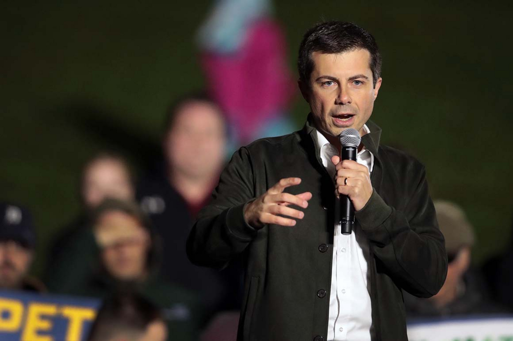

Pete Buttigieg has spent recent Democratic presidential debates sparring with "Medicare for All" proponents, but the South Bend, Ind., mayor backed the concept in a 2018 tweet that resurfaced Wednesday.

The Feb. 18, 2018, message came as part of an exchange with other Twitter users pushing Democratic politicians to support the sweeping health care plan.

"I, Pete Buttigieg, politician, do henceforth and forthwith declare, most affirmatively and indubitably, unto the ages, that I do favor Medicare for All, as I do favor any measure that would help get all Americans covered," Buttigieg tweeted in February 2018. "Now if you'll excuse me, potholes await."

`oembed: https://twitter.com/PeteButtigieg/status/965396700511825920`

Buttigieg is pushing a different health care [plan](https://www.politico.com/story/2019/09/19/pete-buttigieg-2020-health-care-plan-1502581) in the 2020 presidential election, which he calls “Medicare for All Who Want It.” He backs establishing a government-run health insurance alternative to the private insurance industry, but he would allow the use of private insurance if individuals want it.

The plan has been a point of [contrast](https://www.politico.com/news/2019/10/12/pete-buttigieg-health-care-attacks-040307) with Sens. Elizabeth Warren and Bernie Sanders, who support Medicare for All.

In the Democratic presidential debate on Tuesday, Buttigieg said Warren's proposal doesn't "explain how a multitrillion-dollar hole" will be paid for.

Warren responded: "Whenever someone hears the term ‘Medicare for All Who Want It,’ understand what that really means. It's Medicare for all who can afford it. And that's the problem we've got."

Later on, Buttigieg fired back that his plan is "better than 'Medicare for All Whether You Want It or Not.'"

The Buttigieg campaign highlighted his exchanges with other candidates on health care in emails to surrogates on Wednesday.

Buttigieg aides claimed there was no contradiction between the tweet and his current position, citing Buttigieg’s support for a smooth transition to universal coverage.

Lis Smith, a top aide to Buttigieg, [tweeted](https://twitter.com/Lis_Smith/status/1184563920947892224) Wednesday afternoon that "Pete's always supported making a public health insurance vehicle like Medicare available to all Americans in order to achieve universal health care. That's why he developed the most common sense plan for any Democrat in the race for president that would do just that. Any more q's?”

The Buttigieg campaign also pointed to his comments on health care in a February appearance on PBS.

"I think most Americans understand that we deserve to have universal health care as enjoyed by most citizens of most developed countries," Buttigieg said then. "Now, there are some legitimate questions about the pathway to Medicare for All.

"Take a version of Medicare," Buttigieg continued, "or something like it, make it available as a public option on the exchange, and then if people like me are right that this will, over time, become the most efficient and preferred means, then this will be a very natural glide path to a single-payer environment."